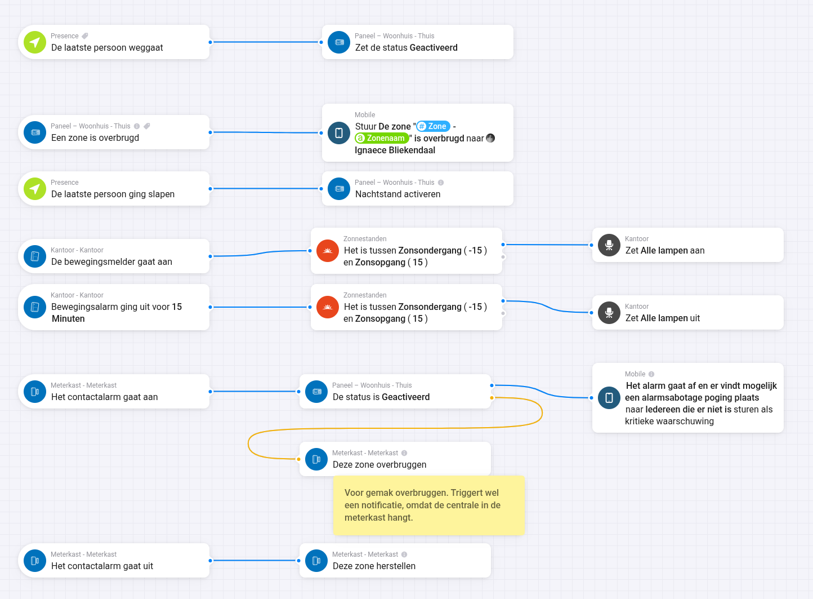

# aritech-ats-homey

A [Homey app](https://homey.app/a/au.com.aritech.ats/test/) that integrates Aritech / ATS **Advisor Advanced** alarm panels (IP based) over your local network.

Monitor and control your panel directly from Homey: arm and disarm areas, follow area and zone status in real time, and build Flows around your security system.

> This is an unofficial, community-developed app. It is not affiliated with, endorsed by, or supported by Aritech or KGS (Kidde Global Services).

## Features

- **Arm / disarm areas**: full arm and part-arm, mapped to Homey's native alarm state.
- **Live status**: area and zone state pushed in real time (COS events).
- **Alarm indicators**: intrusion, fire, tamper, panic, medical and duress.
- **Area readiness**: ready to arm, open zones, zone faults and inhibited zones.
- **Signalling state**: internal siren, external siren, strobe, buzzer and isolated zones, hidden from the device tile but available for Flows and Insights.
- **Flow cards**: triggers, conditions and actions for arming, force-arm, night-arm, inhibiting/uninhibiting zones and checking whether an area can be armed.
- **Repair**: reconfigure a paired device (host/port/credentials) without removing it.
- **Readable errors**: panel, network and encryption-key problems are shown as clear messages instead of raw codes.
- **Optional per-device debug logging**, off by default.

## Example Flows



What these Flows do, top to bottom:

- **Arm when the house empties**: the last person leaves and the area is armed. A second Flow switches to night mode when the last person goes to sleep.
- **Report a bypassed zone**: the area trigger passes the zone number and name along, so this single Flow reports every zone of the panel, including zones that were never added as a device.
- **Lighting from a detector**: the office PIR turns the lights on after dark, and off again once its motion alarm has been clear for fifteen minutes. A detector that has guarded the house for years doubles as a presence sensor.
- **Bypass a nuisance zone, then restore it**: the meter cupboard houses the panel itself, so opening it while the area is armed alerts everyone who is away of a possible sabotage attempt. While the area is disarmed the same contact is simply bypassed, so it cannot block the next arming, and it is restored the moment it closes.

## Requirements

- An Aritech ATS Advisor Advanced panel with a network (IP) connection.
- The **automation / IP protocol enabled** on the panel (installer/license).
- The panel **encryption key** and a login:
  - PIN for **x500** panels, or
  - username and password for **x700 "everon"** panels (`ATSxxxxA-IP-MM`).

## Tested hardware

The app has only ever run against an **ATS1500**. That is a testing limitation rather than a known incompatibility. Everything else is written from the protocol implementation, not from experience:

- Other **x500** models share the same protocol and PIN login, so they are expected to behave identically.
- **x700 "everon"** panels take a different path: account login, an extra `startMonitor` handshake, PBKDF2 key derivation and 60-byte log entries instead of 70. That code exists but has never met real hardware.

**Testers wanted.** If you run this on anything other than an ATS1500, please [open an issue](https://github.com/5nugg3r/aritech-ats-homey/issues) and describe your panel and what did or did not work. Failures are as useful as successes: a report that pairing breaks on an x700 is worth more than silence.

## Installation

Install from the Homey App Store (once published), or run locally during development:

```bash
homey app run
```

## Development

- Built with the Homey Apps SDK v3 / Homey Compose; `app.json` is generated from `.homeycompose/` and per-driver compose files.
- Validate: `homey app validate --level debug` (or `--level publish`).
- The ATS protocol is implemented by the vendored [`aritech-js`](https://github.com/sebakerckhof/aritech-js) library (`lib/aritech/`).

## License

[AGPL-3.0-or-later](LICENSE). The vendored `aritech-js` source is included with attribution.
